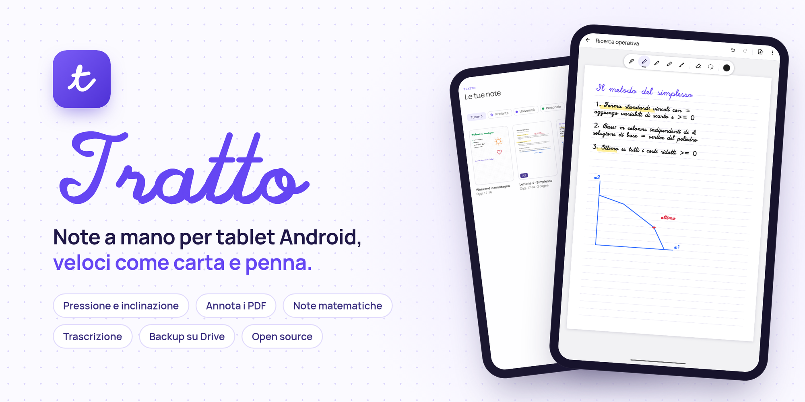
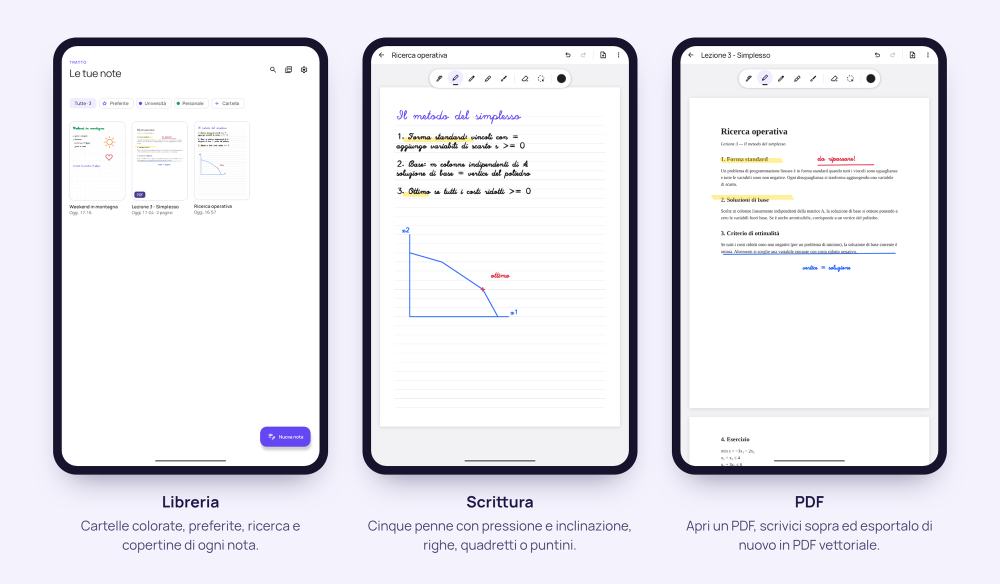
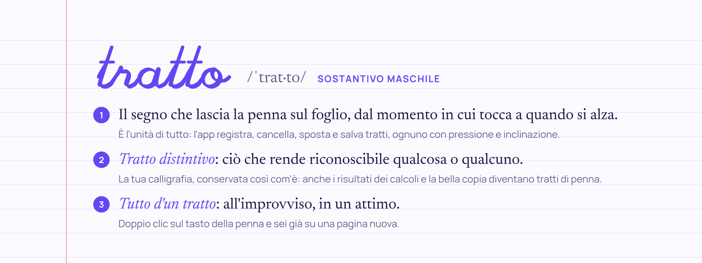
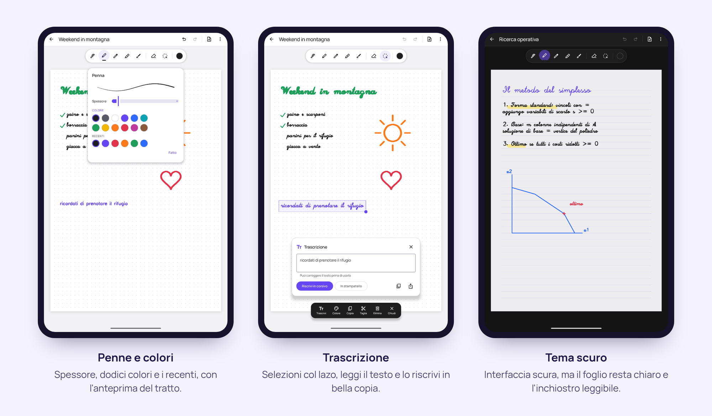

<p align="center">
  
</p>

<p align="center">
  <a href="LICENSE"></a>
  
  
  
  
</p>

**Tratto** è un'app di note a mano per tablet Android con penna attiva. È nata per sostituire Samsung Notes su un Galaxy Tab S6 Lite con LineageOS e fa le stesse cose: penne sensibili a pressione e inclinazione, lazo, pagine a righe o quadretti, PDF da annotare. In più scrive i risultati dei calcoli accanto alle formule, trascrive la tua calligrafia e fa il backup su Google Drive.

Niente account, niente pubblicità, niente statistiche: le note restano sul tablet, in file che puoi leggere anche senza l'app.

<p align="center">
  
</p>

## Perché si chiama Tratto

<p align="center">
  
</p>

## Cosa sa fare

### ✒️ Scrivere come su carta
- **Cinque strumenti**: stilografica con pennino a 45°, penna, matita (la pressione scurisce il segno, l'inclinazione lo allarga), evidenziatore che passa *sotto* l'inchiostro, pennello.
- **Pressione e inclinazione** della penna, con sensibilità regolabile. L'inchiostro è disegnato in *front buffer* con [Jetpack Ink](https://developer.android.com/jetpack/androidx/releases/ink) e la predizione del movimento: il tratto sta attaccato alla punta.
- **Gomma** per tratti interi o parziale, anche tenendo premuto il tasto della penna o con la punta gomma, sulle penne che ce l’hanno.
- **Lazo** per spostare, ridimensionare, ricolorare, copiare e incollare anche tra note diverse.
- **Palmo appoggiato**: le dita vengono ignorate mentre la penna tocca o si avvicina allo schermo. Con due dita scorri e ingrandisci, doppio tocco per tornare a pagina intera.
- Pagine **bianche, a righe, a quadretti o a puntini**, annulla e ripeti, tema chiaro e scuro.

### ⚡ Una nota nuova in un attimo
- **Doppio clic sul tasto della penna**: si apre subito una nota nuova, da qualunque punto dell'app.
- Riquadro nelle impostazioni rapide, scorciatoia "Nuova nota" sull'icona e icona dedicata in Home.
- Avvio a freddo in circa **0,4 secondi** sul Tab S6 Lite, animazioni di apertura che partono dalla copertina della nota.

### 📄 PDF
- Apri un PDF da Tratto o condividilo verso Tratto da qualsiasi app, e scrivici sopra come su una pagina qualsiasi.
- Esporta la nota in **PDF vettoriale** (l'inchiostro resta nitido a ogni ingrandimento) o una pagina come immagine.

### 🧮 Note matematiche
Scrivi un'espressione e poi `=`: Tratto la legge e scrive il risultato accanto, come tratti di penna modificabili. Capisce `+ − × ÷`, frazioni, potenze, radici, parentesi, percentuali e π.

### 🔤 Trascrizione e bella copia
Seleziona una frase col lazo e **trascrivila** in testo, da copiare o condividere. Oppure fai la **bella copia**: la frase viene riscritta al suo posto in corsivo o stampatello, con i caratteri a tratto singolo di [Hershey](https://en.wikipedia.org/wiki/Hershey_fonts). Il riconoscimento gira tutto sul tablet ([ML Kit Digital Ink](https://developers.google.com/ml-kit/vision/digital-ink-recognition)); serve la rete solo per scaricare una volta il modello italiano.

### ☁️ Backup
- **File `.tratto`**: tutte le note in un unico file da salvare dove vuoi, ripristinabile unendo o sostituendo.
- **Google Drive**: backup automatico (anche solo su Wi‑Fi o in carica) in una cartella che vede solo Tratto. L'app usa il permesso `drive.file`: non può leggere nient'altro del tuo Drive. Dettagli in [docs/backup.md](docs/backup.md).

<p align="center">
  
</p>

## Installare

| Dove | Versione | Note |
| --- | --- | --- |
| **Repository F-Droid di Tratto** | completa | Aggiornamenti automatici dal client F-Droid. Istruzioni qui sotto. |
| **F-Droid ufficiale** | libera | In arrivo. Senza componenti Google: niente trascrizione, note matematiche e Drive. Il backup automatico va in una cartella a scelta. |
| **[Release su GitHub](https://github.com/Frumorn12/tratto/releases)** | completa | APK da installare a mano. |

Serve **Android 15 o più recente** su processore a 64 bit (arm64) e una penna attiva (S Pen, Wacom EMR, USI). Tratto è provato ogni giorno su un Galaxy Tab S6 Lite (SM-P610) con LineageOS 23.2.

<!-- repo-fdroid -->

## Come sono fatte le note

Tutto sta nella memoria privata dell'app, in file semplici:

```
tratto/
├── indice.json                 note, cartelle, preferite
└── note/<id>/
    ├── nota.json               titolo, pagine, sfondi
    ├── pagine/<pagina>.tp      i tratti della pagina (binario)
    ├── allegato.pdf            il PDF originale, se c'è
    └── anteprima.webp          la copertina
```

Un file `.tp` comincia con `TRTP` e la versione, poi contiene i tratti uno dopo l'altro in little endian: penna, colore, spessore e per ogni punto `x, y, pressione, inclinazione, orientamento, tempo`. Le pagine si salvano in modo atomico (file temporaneo, `fsync`, rinomina): un'interruzione non lascia mai una pagina a metà. Il backup `.tratto` è uno ZIP con la stessa struttura.

## Compilare

Servono JDK 21 e l'Android SDK (piattaforma 37).

```sh
export ANDROID_HOME=$HOME/Android/Sdk
./gradlew :app:assembleCompletaRelease   # con ML Kit e Google Drive
./gradlew :app:assembleLiberaRelease     # solo software libero, quella di F-Droid
./gradlew :app:testCompletaDebugUnitTest
```

`tools/installa.sh` compila, installa sul tablet collegato e precompila l'app con `cmd package compile -m speed`. `tools/penna.py` simula la S Pen (pressione, inclinazione, tasto, scrittura in corsivo) scrivendo eventi in `/dev/input`: è così che Tratto viene provato senza toccare il tablet.

## Grazie a

- [Jetpack Ink](https://developer.android.com/jetpack/androidx/releases/ink) e [Jetpack Compose](https://developer.android.com/compose) (Apache 2.0)
- [PdfBox-Android](https://github.com/TomRoush/PdfBox-Android) (Apache 2.0)
- [ML Kit Digital Ink Recognition](https://developers.google.com/ml-kit/vision/digital-ink-recognition), solo nella versione completa
- [Manrope](https://github.com/sharanda/manrope) di Mikhail Sharanda (SIL Open Font License, [docs/OFL-Manrope.txt](docs/OFL-Manrope.txt))
- I caratteri di [A. V. Hershey](https://en.wikipedia.org/wiki/Hershey_fonts) ([docs/Hershey-fonts.txt](docs/Hershey-fonts.txt))
- [Material Symbols](https://fonts.google.com/icons) (Apache 2.0)

## In English

**Tratto** ("stroke", as in a pen stroke) is a handwriting notes app for Android tablets with an active stylus, built as a Samsung Notes replacement for a Galaxy Tab S6 Lite running LineageOS. Pressure- and tilt-sensitive pens with low-latency front-buffered ink, lasso, eraser, ruled/grid/dot pages, PDF annotation and vector PDF export, handwritten math (write an expression and `=`, the result appears next to it), on-device handwriting transcription, and backups to a file or Google Drive. No accounts, no ads, no analytics. The UI is in Italian.

## Licenza

[MIT](LICENSE): puoi usare, modificare e ridistribuire Tratto come vuoi, anche in progetti commerciali, mantenendo l'avviso di copyright.
