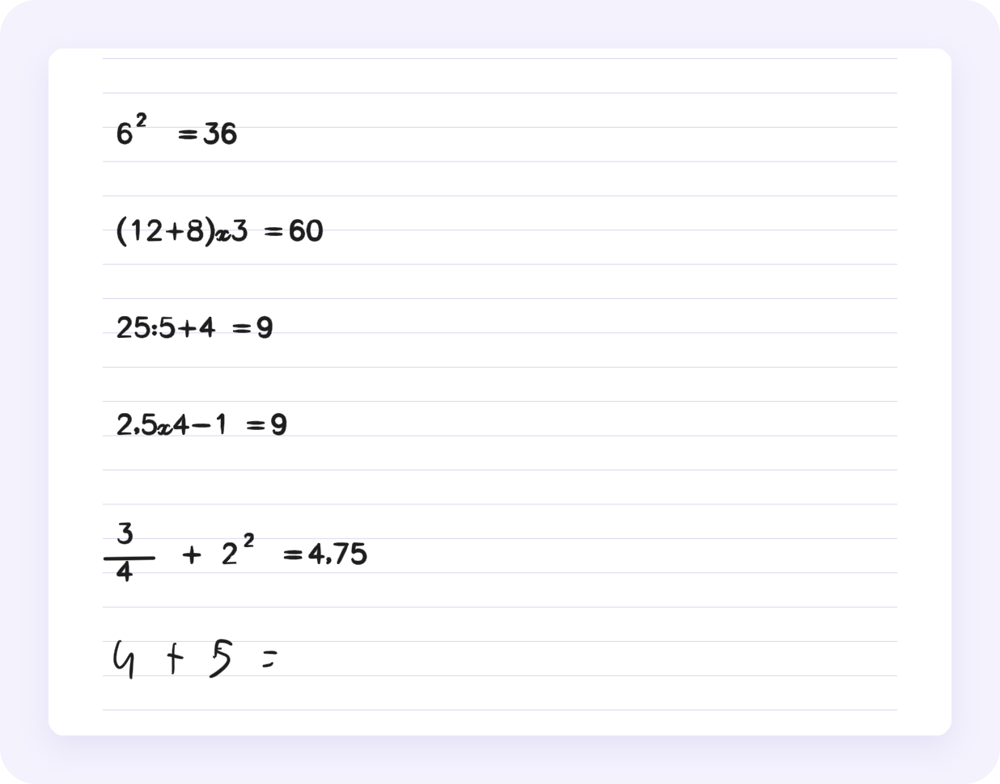

<p align="center">
  
</p>

<p align="center">
  <a href="LICENSE"></a>
  
  
  
  
</p>

**Tratto** is a handwriting notes app for Android tablets with an active stylus. It started as a Samsung Notes replacement for a Galaxy Tab S6 Lite running LineageOS, and does what Samsung Notes does: pens that respond to pressure and tilt, lasso, ruled and grid paper, PDFs you can write on. On top of that it solves the math you write, transcribes your handwriting and backs up to Google Drive.

No accounts, no ads, no analytics. Your notes stay on the tablet, in plain files that are documented below.

<p align="center">
  
</p>

## Why "Tratto"

<p align="center">
  
</p>

## Features

### ✒️ Write like on paper
- **Five tools**: fountain pen with a 45° nib, ballpoint, pencil (pressure darkens it, tilt widens it), a highlighter that goes *under* the ink, and a brush.
- **Pressure and tilt**, with adjustable sensitivity. Ink is drawn to the front buffer with [Jetpack Ink](https://developer.android.com/jetpack/androidx/releases/ink) plus motion prediction, so the stroke stays glued to the pen tip.
- **Eraser** for whole strokes or partial erasing. It also works while you hold the pen button, or with the eraser end on pens that have one.
- **Lasso** to move, resize, recolour, copy and paste, even between notes.
- **Palm rejection**: fingers are ignored while the pen touches or hovers over the screen. Scroll and zoom with two fingers, double-tap to fit the page.
- **Blank, ruled, grid or dotted** pages, undo and redo, light and dark theme.

### ⚡ A new note in an instant
- **Double-click the pen button** and a new note opens right away, from anywhere in the app.
- **Quick note**: a small sheet that floats over any app, from its Quick Settings tile or the accessibility shortcut. Write, close, and it is already saved in your library; left empty, it leaves nothing behind. Math works there too.
- Quick Settings tile, a "New note" launcher shortcut and a dedicated home screen icon.
- Cold start in about **0.4 seconds** on a Tab S6 Lite. Opening a note animates it out of its cover.

### 📄 PDF
- Open a PDF from Tratto, or share one to Tratto from any app, and write on it like on any other page.
- Export notes as **vector PDF** (the ink stays sharp at any zoom), or a single page as an image.

### 🧮 Handwritten math
Write an expression followed by `=` and Tratto writes the result next to it, as pen strokes you can edit. It understands `+ − × ÷`, fractions, powers, roots, parentheses, percentages and π.

<p align="center">
  
</p>

### 🔤 Transcription and neat copy
Lasso a sentence to **transcribe** it into text you can copy or share. Or make a **neat copy**: the sentence is rewritten in place in cursive or print, using the single-stroke [Hershey fonts](https://en.wikipedia.org/wiki/Hershey_fonts). Recognition runs entirely on the tablet with [ML Kit Digital Ink](https://developers.google.com/ml-kit/vision/digital-ink-recognition); the network is only needed once, to download the language model.

### ☁️ Backup
- **`.tratto` file**: all your notes in one file you can store anywhere, restored by merging or replacing.
- **Google Drive**: automatic backups (optionally only on Wi‑Fi or while charging) into a folder only Tratto can see. The app asks for the `drive.file` scope, so it cannot read anything else in your Drive. Details in [docs/backup.md](docs/backup.md).

<p align="center">
  
</p>

## Install

| Where | Build | Notes |
| --- | --- | --- |
| **[Tratto's F-Droid repository](https://frumorn12.github.io/tratto-fdroid/)** | full | Automatic updates through the F-Droid client. See below. |
| **Official F-Droid** | free | Coming soon. No Google components, so no transcription, math or Drive; automatic backups go to a folder of your choice instead. |
| **[GitHub releases](https://github.com/Frumorn12/tratto/releases)** | full | APK to install by hand. |

Tratto needs **Android 15 or newer**, a 64-bit ARM processor and an active stylus (S Pen, Wacom EMR, USI). It is used every day on a Galaxy Tab S6 Lite (SM-P610) running LineageOS 23.2.

The interface is in Italian for now. Translations are welcome.

### Adding Tratto's F-Droid repository

<a href="https://frumorn12.github.io/tratto-fdroid/"></a>

Open [frumorn12.github.io/tratto-fdroid](https://frumorn12.github.io/tratto-fdroid/) on your tablet and tap **Aggiungi il repository a F-Droid**, or add it by hand in F-Droid › Settings › Repositories:

```
https://frumorn12.github.io/tratto-fdroid/repo
fingerprint 5A237B0F6FDB31B94D8A0D3414ACE1C047FB1FE931B4C2F6E595E03E1F99ECE0
```

The full and free builds are signed differently: to switch, back up from Tratto (Settings › Backup), uninstall, reinstall and restore.

## How notes are stored

Everything lives in the app's private storage, in simple files:

```
tratto/
├── indice.json                 notes, folders, favourites
└── note/<id>/
    ├── nota.json               title, pages, backgrounds
    ├── pagine/<page>.tp        the page's strokes (binary)
    ├── pagine/<page>.oggetti.json   images and text boxes on the page, if any
    ├── immagini/<id>.webp      pasted or inserted images
    ├── allegato.pdf            the original PDF, if any
    └── anteprima.webp          the cover
```

A `.tp` file starts with `TRTP` and a version number, followed by the strokes in little endian: tool, colour, size, and for every point `x, y, pressure, tilt, orientation, time`. Pages are saved atomically (temporary file, `fsync`, rename), so an interruption never leaves a half-written page. A `.tratto` backup is a ZIP with the same layout.

Images and text boxes live in a small JSON file next to the page (`FormatoOggetti.kt`), drawn under the ink in list order. Text boxes keep rich text as paragraphs (style, alignment, list) made of runs (bold, italic, underline, strikethrough, colour, highlight, size, font). Notes from before have no such file and open unchanged.

## Building

You need JDK 21 and the Android SDK (platform 37).

```sh
export ANDROID_HOME=$HOME/Android/Sdk
./gradlew :app:assembleCompletaRelease   # full build: ML Kit and Google Drive
./gradlew :app:assembleLiberaRelease     # free software only, the F-Droid build
./gradlew :app:testCompletaDebugUnitTest
```

`tools/installa.sh` builds, installs on the connected tablet and precompiles the app with `cmd package compile -m speed`. `tools/penna.py` simulates the S Pen (pressure, tilt, button, cursive handwriting) by writing events to `/dev/input`: that is how Tratto gets tested without touching the tablet.

The code, comments and commit messages are in Italian.

## Thanks to

- [Jetpack Ink](https://developer.android.com/jetpack/androidx/releases/ink) and [Jetpack Compose](https://developer.android.com/compose) (Apache 2.0)
- [PdfBox-Android](https://github.com/TomRoush/PdfBox-Android) (Apache 2.0)
- [ML Kit Digital Ink Recognition](https://developers.google.com/ml-kit/vision/digital-ink-recognition), full build only
- [Manrope](https://github.com/sharanda/manrope) by Mikhail Sharanda (SIL Open Font License, [docs/OFL-Manrope.txt](docs/OFL-Manrope.txt))
- The fonts of [A. V. Hershey](https://en.wikipedia.org/wiki/Hershey_fonts) ([docs/Hershey-fonts.txt](docs/Hershey-fonts.txt))
- [Material Symbols](https://fonts.google.com/icons) (Apache 2.0)

## License

[MIT](LICENSE): use, modify and redistribute Tratto however you like, including in commercial projects, as long as you keep the copyright notice.
